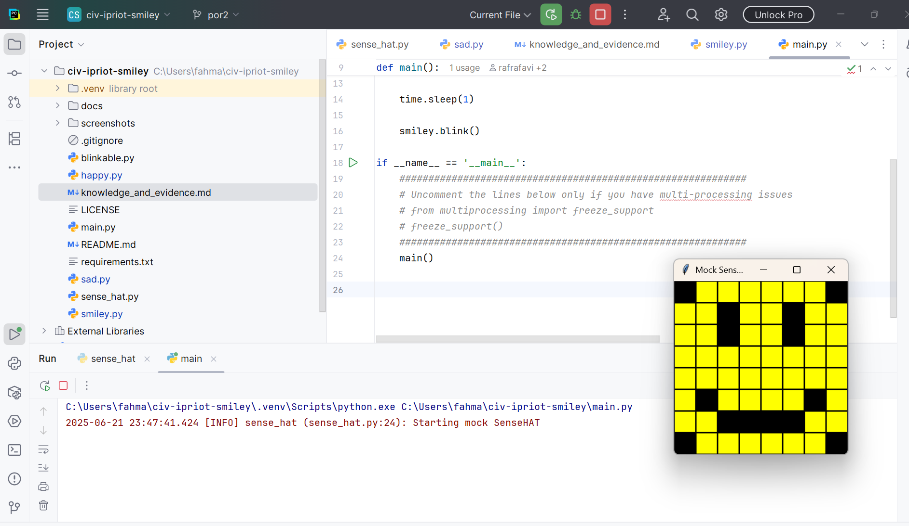
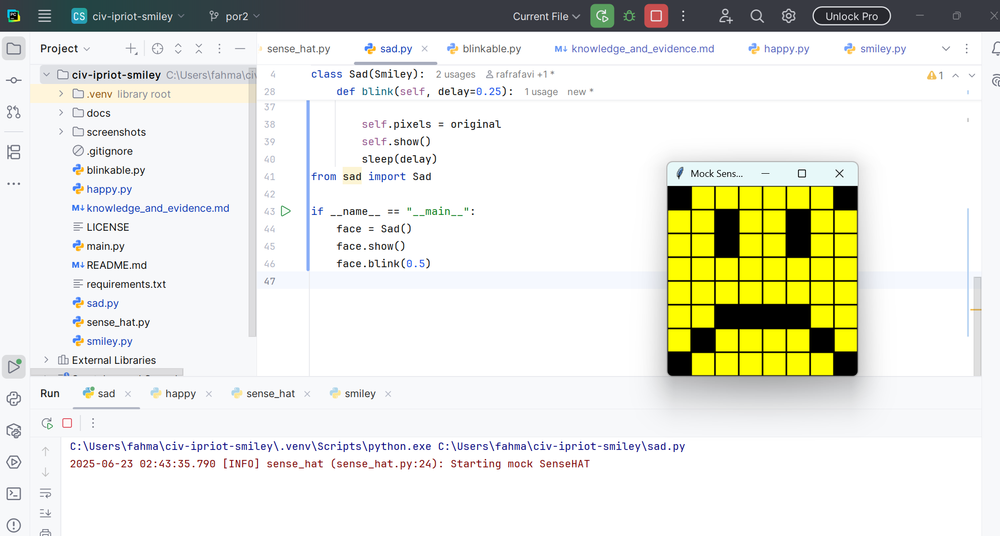
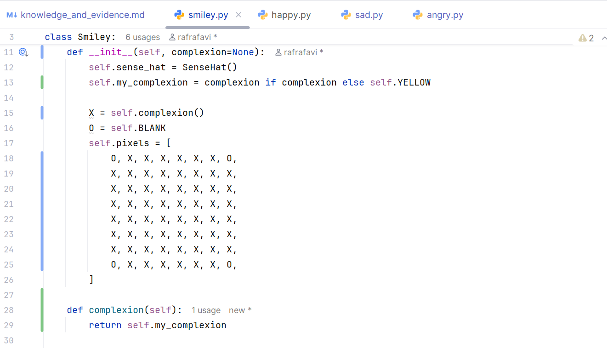

# Evidence and Knowledge

This document includes instructions and knowledge questions that must be completed to receive a *Competent* grade on this portfolio task.

## 1. Required evidence

### 1.1. Answer all questions in this document

- Each answer should be complete, well-articulated, and within the specified word count limits (if added) for each question.
- Please make sure **all** external sources are properly cited.
- You must **use your own words**. Please include your full chat transcripts if you use generative AI in any way.
- Generative AI hallucinates, is not an authoritative source

### 1.2. Make all the required modifications to the code

- Please follow the instructions in this document to make the changes needed to the code.

- When requested to upload evidence, upload all screenshots to `screenshots/` and embed them in this document. For example:

```markdown

```


> Note the `!`, and the use of a relative path.

- You must upload the code into your GitHub repository.
- While you can use a branch, your code should be in main when you submit.
- Upload a zip of this repository to Blackboard when you are ready to submit.
- You will be notified of your result via Blackboard
- However, if using GitHub classrooms, you may also receive additional feedback on GitHub directly

### 1.3. Optional: Use of Raspberry Pi and SenseHat

Raspberry Pi or SenseHat is **optional** for this activity. You can use the included `sense_hat.py` file to simulate the SenseHat on your computer.

If you use a Pi, please **delete** the `sense_hat.py` file.

### 1.4. Accessible version of the code

This project relies on visual patterns that appear on an LED matrix. If you have any accessibility requirements, you can use the `udl/accessible` branch to complete the project. This branch provides an accessible code version that uses text-based patterns instead of visual ones.

Please discuss this with your lecturer before using that branch.

## 2. Specific Tasks & Questions

Address the following tasks and questions based on the code provided in this repository.

### 2.1. Set up the project locally

1. Fork this repository (if not using GitHub Classrooms)
2. Clone your repository locally
3. Run the project locally by executing the `main.py` file
4. Evidence this by providing screenshots of the project directory structure and the output of the `main.py` file



If you are running on a Raspberry Pi, you can use the following command to run the project and then screenshot the result:

```bash
ls
python3 main.py
```

### 2.2. Fundamental code comprehension

 Answer each of the following questions **as they relate to that code** supplied by in this repository (ignore `sense_hat.py`):

1. Examine the code for the `smiley.py` file and provide  an example of a variable of each of the following types and their corresponding values (`_` should be replaced with the appropriate values):

   | Type                    | name        | value |
   | ----------              |-------------|-----|
   | built-in primitive type | delay       | 0.25 |
   | built-in composite type | self.pixels | List of 8 pixel tuples (2D matrix)    |
   | user-defined type       | self        | Instance of Smiley class    |

2. Fill in (`_`) the following table based on the code in `smiley.py`:

   | Object                   | Type |
   | ------------             |------|
   | self.pixels              | list |
   | A member of self.pixels  | tuple |
   | self                     | Happy (subclass of Smiley)     |

3. Examine the code for `smiley.py`, `sad.py`, and `happy.py`. Give an example of each of the following control structures using an example from **each** of these files. Include the first line and the line range:

   | Control Flow | File      | First line          | Line range |
   | ------------ |-----------|---------------------|------------|
   |  sequence    | smiley.py | defshow(self):      | 35-39      |
   |  selection   | happy.py  | if delay > 0:       | 19-23      |
   |  iteration   | happy.py  | for pixel in mouth: | 21-23      |

4. Though everything in Python is an object, it is sometimes said to have four "primitive" types. Examining the three files `smiley.py`, `sad.py`, and `happy.py`, identify which of the following types are used in any of these files, and give an example of each (use an example from the code, if applicable, otherwise provide an example of your own):

   | Type                    | Used?  | Example                           |
   | ----------------------- |--------|-----------------------------------|
   | int                     | Yes    | pixel = 41                        |
   | float                   | Yes    | delay(0.25) in blink              |
   | str                     | Yes    | smiley in docstrings              |
   | bool                    | Yes    | True, False(in dimmed, low_light) |

5. Examining `smiley.py`, provide an example of a class variable and an instance variable (attribute). Explain **why** one is defined as a class variable and the other as an instance variable.

>YELLOW = (255, 255, 0) is a class variable (defined at the class level and shared).
self.pixels is an instance variable (defined inside __init__, unique to each object).
Class variables define shared constants like colors; instance variables represent object state.
>

6. Examine `happy.py`, and identify the constructor (initializer) for the `Happy` class:
   1. What is the purpose of a constructor (in general) and this one (in particular)?

   >def __init__(self):
This is the constructor for the Happy class.
It initializes the smiley with a happy face pattern by calling:

   >

   2. What statement(s) does it execute (consider the `super` call), and what is the result?

   >super().__init__(color=Smiley.YELLOW)
super() ensures the Smiley class’s constructor runs, setting color and creating a base pixel matrix.
   >

### 2.3. Code style

1. What code style is used in the code? Is it likely to be the same as the code style used in the SenseHat? Give to reasons as to why/why not:

>PEP 8 — clear naming, spacing, and docstrings.
Likely same as SenseHat?
Possibly not. Real SenseHAT is written in C/C++; this is student Python code. Their internal style may differ

>

2. List three aspects of this convention you see applied in the code.

>Snake_case for function names (draw_eyes)
Triple-quoted docstrings
Constants in ALL_CAPS (YELLOW)

>

3. Give two examples of organizational documentation in the code.

>Docstring in class: """Provides a Smiley with a happy expression"""
Inline comment in draw_eyes: # eyes open or closed


>

### 2.4. Identifying and understanding classes

> Note: Ignore the `sense_hat.py` file when answering the questions below

1. List all the classes you identified in the project. Indicate which classes are base classes and which are subclasses. For subclasses, identify all direct base classes.
  
  Use the following table for your answers:

| Class Name  | Super or Sub? | Direct parent(s) |
|-------------|---------------|------------------|
| Smiley      | Super         | Object           |
| Happysmiley | Sub           | Smiley           |   
| Sadsmiley   | Sub           | Smiley           |


2. Explain the concept of abstraction, giving an example from the project (note "implementing an ABC" is **not** in itself an example of abstraction). (Max 150 words)

>Abstraction means exposing only relevant behavior. 
The Blinkable class defines a blinking interface without specifying how blinking is done—leaving it to the subclasses.
This allows polymorphic interaction while hiding internal specifics

>

3. What is the name of the process of deriving from base classes? What is its purpose in this project? (Max 150 words)

>Inheritance — It allows Happy and Sad to reuse shared smiley behavior from Smiley and customize specific expressions without rewriting setup/display logic

>

### 2.5. Compare and contrast classes

Compare and contrast the classes Happy and Sad.

1. What is the key difference between the two classes?
   >The key difference between the HappySmiley and SadSmiley classes is the pixel representation used to display the emotion on the LED matrix.
Each class defines a unique pattern of colors in the image or pixels attribute that represents either a happy or sad facial expression.
   >
2. What are the key similarities?
   >Both classes inherit from the same base class (Smiley), meaning they share the same structure and interface.
Each class implements the show() method, which displays the image on the SenseHAT’s LED matrix.
Both use similar logic and structure to define their facial expression using a list of pixel values.
They follow the same code style and naming conventions.
   >
3. What difference stands out the most to you and why?
   > The most noticeable difference is the mouth shape in the pixel pattern—HappySmiley uses a curve that turns upward (😊), 
while SadSmiley uses a curve that turns downward (☹️). 
This difference stands out because it is the primary visual cue that conveys the emotion,
which is central to the purpose of each class.
   >
4. How does this difference affect the functionality of these classes
   > This difference in pixel layout affects how the emotion is displayed on the SenseHAT.
   >

### 2.6. Where is the Sense(Hat) in the code?

1. Which class(es) utilize the functionality of the SenseHat?
   > The Smiley class utilizes the functionality of the SenseHat. 
   >
2. Which of these classes directly interact with the SenseHat functionalities?
   > The Smiley class is the only one that directly interacts with the SenseHat API.
   >
3. Discuss the hiding of the SenseHAT in terms of encapsulation (100-200 Words)
   > Encapsulation is the principle of hiding internal details and exposing only what is necessary. In this project, encapsulation is applied by restricting direct interaction with the SenseHat to a single class—Smiley. This class handles all SenseHat-specific functionality, such as setting pixels or clearing the display.
   > Subclasses like HappySmiley or SadSmiley do not interact with the SenseHat directly; instead, they define image data and rely on inherited methods to perform actions. 
   >

### 2.7. Sad Smileys Can’t Blink (Or Can They?)

Unlike the `Happy` smiley, the current implementation of the `Sad` smiley does not possess the ability to blink. Let's first explore how blinking has been implemented in the Happy Smiley by examining the blink() method, which takes one argument that determines the duration of the blink.

**Understanding Blink Mechanism:**

1. Does the code's author believe that every `Smiley` should be able to blink? Explain.

> - No, not necessarily — only Blinkable-inheriting smileys are expected to blink.

>

2. For those smileys that blink, does the author expect them to blink in the same way? Explain.

> Blinking follows a similar pattern, but subclasses can override with timing or behavior variations.
>

3. Referring to the implementation of blink in the Happy and Sad Smiley classes, give a brief explanation of what polymorphism is.

> Polymorphism refers to the ability of different objects to respond to the same method name in different ways. In this project, both Happy and Sad classes can implement their own versions of the blink() method. When a blink() call is made on an object, Python determines at runtime which class’s implementation to use, based on the object’s actual type. 
> This allows each smiley to blink differently if needed, even though the method call remains the same.
>

4. How is inheritance used in the blink method, and why is it important for polymorphism?

> Inheritance allows subclasses like Happy and Sad to extend or override the functionality of the base class Smiley. Although the base class does not define blink(), each subclass can implement it independently. 
> This structure enables polymorphism because we can treat instances of Happy and Sad as Smiley objects and still call blink() on them, knowing that the correct subclass version will execute.
>
1. **Implement Blink in Sad Class:**

   - Create a new method called `blink` within the Sad class. Ensure you use the same method signature as in the Happy class:

   ```python
   def blink(self, delay=0.25):
       pass  # Replace 'pass' with your implementation
   ```

2. **Code Implementation:** Implement the code that allows the Sad smiley to blink. Use the implementation from the Happy Smiley as a reference. Ensure your new method functions similarly by controlling the blink duration through the `delay` argument.

3. **Testing the Implementation:**

- Test the new blink functionality on your Raspberry Pi or within the Python classes provided. You might need to adjust the `main.py` script to incorporate Sad Smiley's new blinking capability.

Include a screenshot of the sad smiley or the modified `main.py`:



- Observe and document the Sad smiley as it blinks its eyes. Describe any adjustments or issues encountered during implementation.

  > Observation:
The Sad smiley successfully blinks its eyes by temporarily changing the eye pixels to yellow (indicating closed eyes) and then reverting to the original pixels. When blink() is called, the eyes visibly close for the specified duration and then reopen, closely mimicking the blink behavior seen in the Happy class.
Adjustments Made:
Method Definition Fix: The original blink() method was not correctly indented within the Sad class, so it was never recognized as part of the class. This was fixed by placing it properly inside the class body.
Used draw_eyes() Method: Instead of manually setting pixels in the blink() method, we reused the draw_eyes(wide_open=False) method for cleaner and reusable code.
Imported sleep: The time.sleep() function was missing and had to be imported from the time module.
Correct Pixel Management: The class uses self.pixels, not self.image, so the blink functionality was rewritten to manipulate the correct attribute.
Issues Encountered:
At first, calling face.blink() resulted in an AttributeError because the method wasn’t defined correctly (outside the class scope).
There was also a logical error in the draw_eyes() method where the variable eyes was being reassigned inside the loop, overwriting its own list.
Minor delay tuning was needed to make the blink visually perceptible — using delay=0.5 made the effect clearer.

  ### 2.8. If It Walks Like a Duck…

  Previously, you implemented the blink functionality for the Sad smiley without utilizing the class `Blinkable`. Assuming you did not use `Blinkable` (even if you actually did), consider how the Sad smiley could blink similarly to the Happy smiley without this specific class.

  1. **Class Type Analysis:** What kind of class is `Blinkable`? Inspect its superclass for clues about its classification.

     > Blinkable is an abstract base class (ABC). Its superclass is likely ABC or ABCMeta from Python’s abc module, which is used to define abstract classes that cannot be instantiated on their own and are meant to be inherited.

  2. **Class Implementation:** `Blinkable` is a class intended to be implemented by other classes. What generic term describes this kind of class, which is designed for implementation by others? **Clue**: Notice the lack of any concrete implementation and the naming convention.

  > This kind of class is commonly referred to as an interface or abstract base class. It defines a set of methods (like blink) that other classes must implement without providing any actual implementation itself.

  3. **OO Principle Identification:** Regarding your answer to question (2), which Object-Oriented (OO) principle does this represent? Choose from the following and justify your answer in 1-2 sentences: Abstraction, Polymorphism, Inheritance, Encapsulation.

  > Abstraction.
Blinkable hides the implementation details and exposes only the method signature. This allows subclasses to implement the behavior in their own way while interacting through a consistent interface.

  4. **Implementation Flexibility:** Explain why you could grant the Sad Smiley a blinking feature similar to the Happy Smiley's implementation, even without directly using `Blinkable`.

  > In Python, you can define a blink() method in any class without requiring it to inherit from Blinkable. As long as the method matches what is expected (i.e., the method signature and behavior), the Sad class can behave like a "Blinkable" object even without formally inheriting from it.

  5. **Concept and Language Specificity:** In relation to your response to question (4), what is this capability known as, and why is it feasible in Python and many other dynamically typed languages but not in most statically typed programming languages like C#? **Clue** This concept is hinted at in the title of this section.

  > This is known as duck typing — "If it walks like a duck and quacks like a duck, it's a duck."
Python doesn’t require explicit type declarations, so any object with a blink() method can be used in place of a Blinkable object. In statically typed languages like C#, interfaces must be explicitly implemented for a class to be used interchangeably, enforcing stricter type constraints.

  ***

  ## 3. Refactoring

  ### 3.1. Does a Smiley Have to Be Yellow?

  While our current implementation predominantly features yellow smileys, emotional expressions like sickness or anger typically utilize colors like green, red, or orange. We'll explore the feasibility of integrating these colors into our smileys.

  1. **Defined Colors and Their Location:**

     1. Which colors are defined and in which class(s)?
        > The color constants are defined in the Smiley class. These include:
YELLOW = (255, 255, 0)
RED = (255, 0, 0)
GREEN = (0, 255, 0)
BLANK = (0, 0, 0)
     2. What type of variables hold these colors? Are the values expected to change during the program's execution? Explain your answer.
        > These are class variables (also called static variables), shared across all instances of the class. 
        > Their values are defined once and are not expected to change at runtime, since they serve as constant color definitions for rendering pixel patterns.
        > These help ensure consistency and reduce repetition across different smiley classes.


     3. Add the color blue to the appropriate class using the appropriate format and values.
> Inside the Smiley class:
> BLUE = (0, 0, 255)

  2. **Usage of Color Variables:**

     1. In which classes are the color variables used?
        > The color variables (YELLOW, RED, GREEN, BLANK) are used in both the base class Smiley and the subclasses Happy and Sad. For example, Sad uses self.BLANK and self.YELLOW in methods like draw_eyes() and draw_mouth().

  3. **Simple Method to Change Colors:**
  4. What is the easiest way you can think to change the smileys to green? Easiest, not necessarily the best!
     > The easiest way is to redefine the YELLOW constant in the Smiley class to be green:
> Replace all instances of YELLOW in Smiley’s pixel grid with GREEN.


  ### 3.2. Flexible Colors – Step 1

  Changing the color of the smileys once is straightforward, but it isn't very flexible. To facilitate various colors for smileys, it is advisable not to hardcode values in any class. This approach was identified earlier as a necessary change. Let's start by removing the built-in assumptions about color in our classes.

  1. **Add a method called `complexion` to the `Smiley` class:** Implement this instance method to return `self.YELLOW`. Using the term "complexion" instead of "color" provides a more abstract terminology that focuses on the meaning rather than implementation.

  2. **Refactor subclasses to use the `complexion` method:** Modify any subclass that directly accesses the color variable to instead utilize the new `complexion` method. This ensures that color handling is centralized and can be easily modified in the future.

  3. **Determine the applicable Object-Oriented principle:** Consider whether Abstraction, Polymorphism, Inheritance, or Encapsulation best applies to the modifications made in this step.

  4. **Verify the implementation:** Ensure that the modifications function as expected. The smileys should still display in yellow, confirming that the new method correctly replaces the direct color references.

  This step is crucial for setting up a more flexible system for color management in the smiley display logic, allowing for easy adjustments and extensions in the future.

  ### 3.3. Flexible Colors – Step 2

  Having removed the hardcoded color values, we now enhance the base class to support dynamic color assignments more effectively.

  1. **Modify the `__init__()` method in the `Smiley` class:** Introduce a default argument named `complexion` and assign `YELLOW` as its default value. This allows the instantiation of smileys with customizable colors.

  2. **Introduce a new instance variable:** Create a variable called `my_complexion` and assign the `complexion` parameter to it. This step ensures that each smiley instance can maintain its own color state.

  3. **Rationale for `my_complexion`:** Using a distinct instance variable like `my_complexion` avoids potential conflicts with the method parameter names and clarifies that it is an attribute specific to the object.

  4. **Bulk rename:** We want to update our grid to use the value of complexion, but we have so many `Y`'s in the grid. Use your IDE's refactoring tool to rename all instances of the **symbol** `Y` to `X`. Where `X` is the value of the `complexion` variable. Include a screenshot evidencing you have found the correct refactor tool and the changes made.




  5. **Update the `complexion` method:** Adjust this method to return `self.my_complexion`, ensuring that whatever color is assigned during instantiation is what the smiley displays.

  6. **Verification:** Run the updated code to confirm that Smileys still defaults to yellow unless specified otherwise.

  ### 3.4. Flexible Colors – Step 3

  With the foundational changes in place, it's now possible to implement varied smiley colors for different emotional expressions.

  1. **Adjust the `Sad` class initialization:** In the `Sad` class's initializer method, change the superclass call to include the `complexion` argument with the value `self.BLUE`, as shown:

     ```python
     super().__init__(complexion=self.BLUE)
     ```

  2. **Test color functionality for the Sad smiley:** Execute the program to verify that the Sad smiley now appears blue.

  3. **Ensure the Happy smiley remains yellow:** Confirm that changes to the Sad smiley do not affect the default color of the Happy smiley, which should still display in yellow.

  4. **Design and Implement An Angry Smiley:** Create an Angry smiley class that inherits from the `Smiley` class. Set the color of the Angry smiley to red by passing `self.RED` as the `complexion` argument in the superclass call.

  ***
